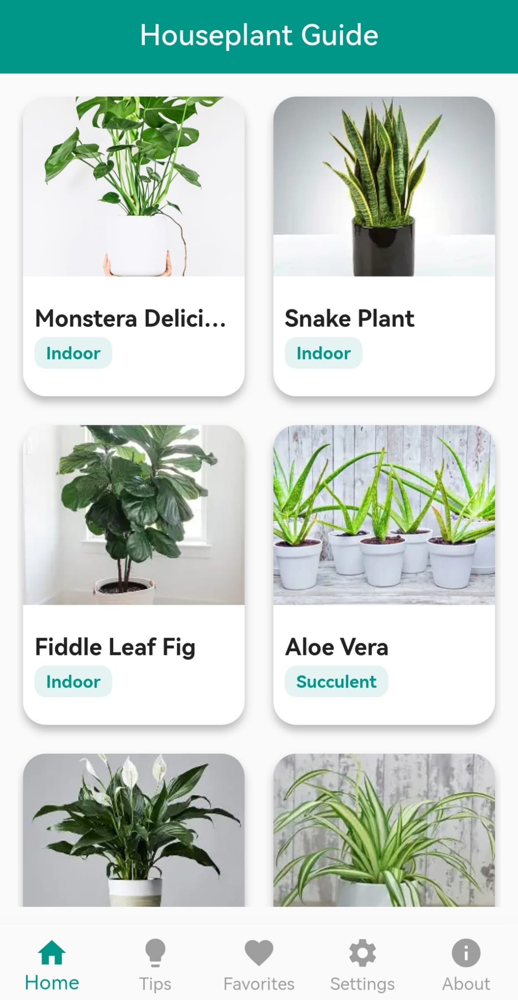
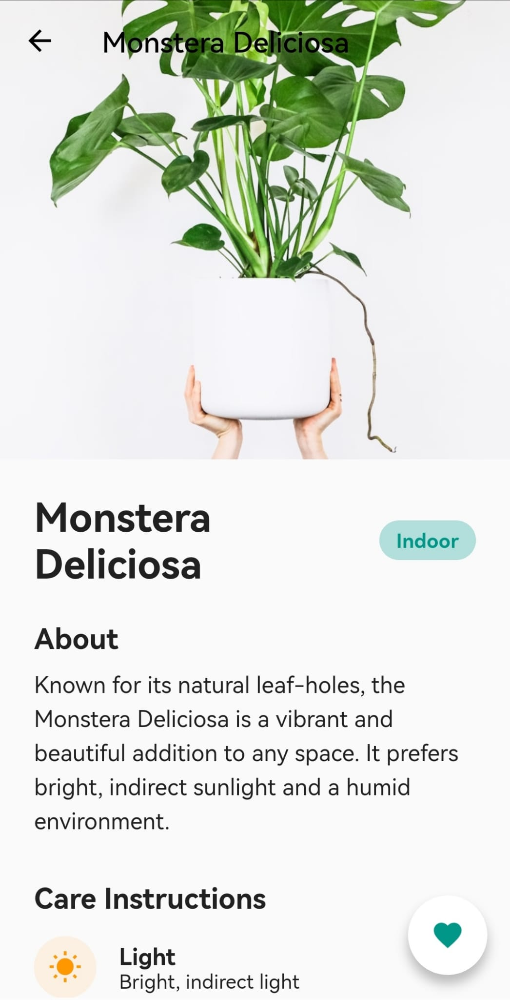
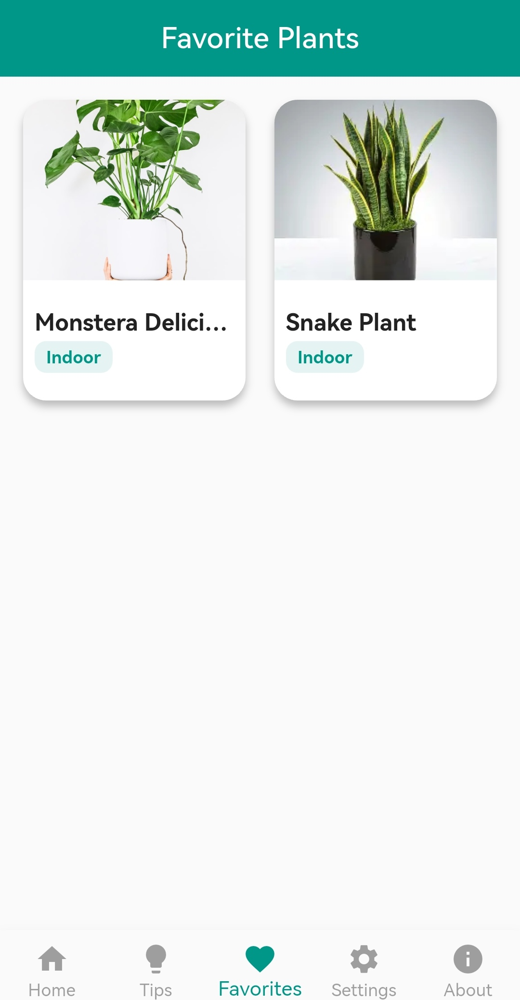
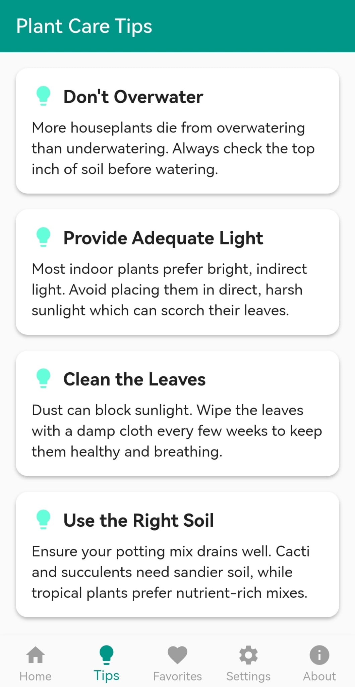
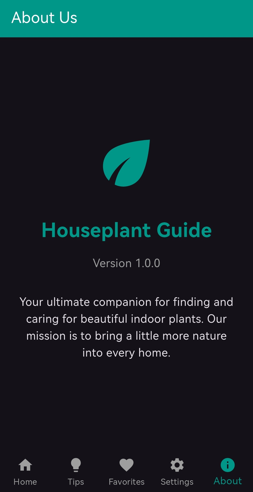

# Houseplant Guide App 🌿

A beautifully designed, feature-rich Flutter application that serves as your personal houseplant catalog and care guide. Built with modern Flutter best practices, this app provides detailed information on various houseplants, including their light and watering requirements.

## 🌟 Features

*   **Plant Catalog:** Browse through a beautiful grid of popular houseplants.
*   **Detailed Care Instructions:** Get specific light and watering needs for every plant.
*   **Favorites System:** Easily save and access your favorite plants using the global state management.
*   **Dark Mode Support:** Seamlessly toggle between light and dark themes in the Settings.
*   **Plant Care Tips:** Read through useful, general tips to keep your green friends alive and thriving.
*   **Bottom Navigation:** Clean and intuitive bottom navigation for quick access to all screens.

## 📸 Screenshots

Here is a glimpse of the Houseplant Guide app in action!

| Home Page | Details Page | Favorites Page |
|:---:|:---:|:---:|
|  |  |  |

| Tips Page | Settings (Dark Mode) | About Us (Dark Mode) |
|:---:|:---:|:---:|
|  |  |  |

## 🚀 Getting Started

This project is a great starting point for learning about Flutter's state management, theming, and navigation. 

### Prerequisites

To run this application, you will need:
*   [Flutter SDK](https://docs.flutter.dev/get-started/install) installed on your machine.
*   An IDE like Android Studio, VS Code, or IntelliJ.

### Installation

1.  **Clone the repository:**
    ```bash
    git clone https://github.com/OsmanMj/houseplant_Guide_app.git
    ```
2.  **Navigate to the project directory:**
    ```bash
    cd houseplant_guide_app
    ```
3.  **Get the dependencies:**
    ```bash
    flutter pub get
    ```
4.  **Run the app:**
    ```bash
    flutter run
    ```

## 🛠 Built With

*   **Flutter** - UI Toolkit
*   **Dart** - Programming Language
*   **State Management** - Built-in `ChangeNotifier` and `ListenableBuilder` (No external packages!)

## 🤝 Contributing

Contributions, issues, and feature requests are welcome! Feel free to check the [issues page](https://github.com/OsmanMj/houseplant_Guide_app/issues).
